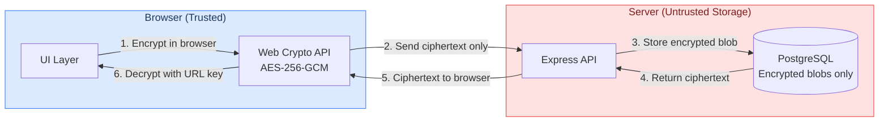

# Phase 19: GitHub Repository Polish - Research

**Researched:** 2026-02-18
**Domain:** GitHub repository documentation, templates, and release management
**Confidence:** HIGH

## Summary

This phase transforms the SecureShare GitHub repository from a working codebase into a professional open source project presentation. The work is purely documentation and repository configuration -- no code changes to the application itself. The deliverables are: a comprehensive README.md with badges, screenshots, Mermaid architecture diagram, and quick-start instructions; GitHub issue templates (YAML forms) and a PR template; CONTRIBUTING.md; SECURITY.md; a LICENSE file; CHANGELOG.md in Keep a Changelog format; and a v3.0 GitHub Release via `gh release create`.

Key technical considerations: (1) The root `.gitignore` contains `*.png` which blocks committing screenshots -- this needs a negation pattern for the screenshot directory. (2) The repo currently has no LICENSE file despite `package.json` listing ISC -- a LICENSE file must be created. (3) Git tags `v1.0` and `v2.0` already exist; `v3.0` needs to be created. (4) The repo is currently private (`norcalcoop/secureshare`); screenshot automation via Playwright needs the local dev server running, not a public URL. (5) GitHub YAML issue forms are the modern approach (not classic markdown templates) and render as structured forms in the GitHub UI.

**Primary recommendation:** Structure as 3 plans: (1) README with badges, screenshots, Mermaid diagram; (2) Issue/PR templates + CONTRIBUTING + SECURITY + LICENSE; (3) CHANGELOG + v3.0 release.

<user_constraints>

## User Constraints (from CONTEXT.md)

### Locked Decisions

#### README structure & tone
- Target audience: both developers evaluating the project AND developers deploying it -- balance technical depth with quick-start practicality in distinct sections
- Tone: warm and approachable -- friendly but competent, like Vite or Astro docs. Inviting to contributors.
- Badges: comprehensive -- CI status, license, Node version, TypeScript, code coverage, last commit
- Mermaid diagram: include a Mermaid-rendered architecture diagram showing browser -> server -> DB trust boundaries (renders natively in GitHub markdown)

#### Screenshots & visuals
- Screenshots generated via Playwright automation -- reproducible and consistent
- Mermaid diagram for architecture (confirmed above)

#### Issue & PR templates
- Three issue template types: Bug Report, Feature Request, and Security Vulnerability
- Bug report: structured fields -- steps to reproduce, expected vs actual, environment, screenshots. YAML frontmatter with labels.
- Security vulnerability template: private reporting guidance (responsible disclosure)

#### Contributing & release
- CHANGELOG follows Keep a Changelog format (keepachangelog.com) -- Added/Changed/Fixed/Removed sections per version
- v3.0 release notes: tell the full journey across all 3 milestones (v1 MVP -> v2 UI & SEO -> v3 Production-Ready). The story of the project.

### Claude's Discretion
- Architecture section depth -- choose what makes the zero-knowledge pitch compelling
- Screenshot selection -- which screens to capture, light/dark choice, framing
- Screenshot storage location in repo
- PR template checklist design -- based on project's quality standards
- Issue template format (YAML forms vs classic markdown)
- CONTRIBUTING.md dev setup detail level and contribution model (open vs curated)

### Deferred Ideas (OUT OF SCOPE)
None -- discussion stayed within phase scope

</user_constraints>

<phase_requirements>

## Phase Requirements

| ID | Description | Research Support |
|----|-------------|-----------------|
| REPO-01 | README includes project description, screenshots, badges (CI, license), install/run instructions, and architecture overview | Shields.io badge URLs, Mermaid diagram syntax, Playwright screenshot automation, README structure patterns |
| REPO-02 | Issue templates for bug reports and feature requests | GitHub YAML issue forms syntax, `.github/ISSUE_TEMPLATE/` directory structure, config.yml for template chooser |
| REPO-03 | Pull request template with checklist | `.github/pull_request_template.md` format, checklist patterns from project quality gates |
| REPO-04 | CONTRIBUTING.md with dev setup, code style, and PR process | Project's existing tooling (ESLint 10, Prettier 3.8, Husky, lint-staged), dev commands from package.json |
| REPO-05 | CHANGELOG.md tracking releases with semantic versioning | Keep a Changelog 1.1.0 format, git tag history (v1.0, v2.0 exist), commit ranges per milestone |
| REPO-06 | GitHub Release created for v3.0 with release notes | `gh release create` CLI syntax, release notes from file, narrative arc across milestones |

</phase_requirements>

## Standard Stack

### Core

| Tool | Version | Purpose | Why Standard |
|------|---------|---------|--------------|
| GitHub Markdown | GFM | README, CONTRIBUTING, CHANGELOG rendering | Native rendering on GitHub, supports Mermaid |
| Mermaid | (GitHub-embedded) | Architecture diagram | Renders natively in GitHub markdown, no image files needed |
| Playwright | 1.58.x (installed) | Screenshot automation | Already in project, scripted for reproducibility |
| GitHub CLI (gh) | latest | Release creation | Official CLI, supports `--notes-file` for release notes |
| Shields.io | API | Badge generation | Industry standard, dynamic SVG badges |

### Supporting

| Tool | Purpose | When to Use |
|------|---------|-------------|
| GitHub YAML Issue Forms | Structured issue templates | Bug report and feature request templates |
| Keep a Changelog format | CHANGELOG structure | Standardized changelog with semantic versioning |
| ISC License | LICENSE file | Match package.json `"license": "ISC"` |

### No Installation Required

This phase requires no new npm packages. All tools are either already installed (Playwright), built into GitHub (Mermaid, YAML forms), or external services (Shields.io, GitHub CLI).

## Architecture Patterns

### Repository File Structure

```
secureshare/
+-- .github/
|   +-- ISSUE_TEMPLATE/
|   |   +-- bug-report.yml          # YAML form: structured bug report
|   |   +-- feature-request.yml     # YAML form: feature request
|   |   +-- security-vulnerability.yml  # Redirects to responsible disclosure
|   |   +-- config.yml              # Template chooser configuration
|   +-- pull_request_template.md    # PR checklist template
|   +-- workflows/
|       +-- ci.yml                  # (already exists)
+-- docs/
|   +-- screenshots/                # Playwright-generated screenshots
|       +-- create-dark.png
|       +-- reveal-dark.png
|       +-- ...
+-- scripts/
|   +-- screenshots.ts             # Playwright screenshot automation script
+-- CHANGELOG.md
+-- CONTRIBUTING.md
+-- LICENSE
+-- README.md                       # Complete project README (replaces placeholder)
+-- SECURITY.md
```

### Pattern 1: YAML Issue Forms (Recommended over Classic Markdown)

**What:** GitHub YAML forms render as structured HTML forms with dropdowns, text areas, and checkboxes -- not raw markdown templates that users must manually fill in.
**When to use:** All issue templates. YAML forms provide better UX and ensure structured data.
**Why:** Users get a real form (not editable markdown), required fields are enforced by GitHub, and the resulting issue body is consistently formatted.

**File location:** `.github/ISSUE_TEMPLATE/bug-report.yml`

**Example (Bug Report):**
```yaml
name: Bug Report
description: Report a bug or unexpected behavior
title: "[Bug]: "
labels: ["bug", "triage"]
body:
  - type: markdown
    attributes:
      value: |
        Thanks for reporting a bug! Please fill out the sections below
        so we can reproduce and fix the issue.

  - type: textarea
    id: description
    attributes:
      label: Describe the bug
      description: A clear and concise description of what the bug is.
      placeholder: What happened?
    validations:
      required: true

  - type: textarea
    id: steps
    attributes:
      label: Steps to reproduce
      description: How can we reproduce the behavior?
      placeholder: |
        1. Go to '...'
        2. Click on '...'
        3. See error
    validations:
      required: true

  - type: textarea
    id: expected
    attributes:
      label: Expected behavior
      description: What did you expect to happen?
    validations:
      required: true

  - type: dropdown
    id: browser
    attributes:
      label: Browser
      options:
        - Chrome
        - Firefox
        - Safari
        - Edge
        - Other
    validations:
      required: true

  - type: textarea
    id: screenshots
    attributes:
      label: Screenshots
      description: If applicable, add screenshots to help explain your problem.
    validations:
      required: false

  - type: textarea
    id: environment
    attributes:
      label: Environment
      description: Any additional environment details
      placeholder: |
        - OS: [e.g., macOS 15, Ubuntu 24.04]
        - Node.js version: [e.g., 24.x]
        - Docker: [yes/no]
    validations:
      required: false
```

**Source:** [GitHub Docs - Syntax for issue forms](https://docs.github.com/en/communities/using-templates-to-encourage-useful-issues-and-pull-requests/syntax-for-issue-forms)

### Pattern 2: Security Vulnerability Template with Redirect

**What:** The security vulnerability "template" is not a form -- it is a `config.yml` entry that redirects users to the SECURITY.md policy or GitHub's private vulnerability reporting.
**Why:** Security vulnerabilities should never be filed as public issues.

**File:** `.github/ISSUE_TEMPLATE/config.yml`
```yaml
blank_issues_enabled: false
contact_links:
  - name: Security Vulnerability
    url: https://github.com/norcalcoop/secureshare/security/advisories/new
    about: Report security vulnerabilities privately. Do NOT create a public issue.
```

Note: The `url` above only works if GitHub private vulnerability reporting is enabled on the repository. If that feature is not available (repo is private or feature not enabled), the SECURITY.md file provides fallback email-based reporting instructions.

**Source:** [GitHub Docs - Adding a security policy](https://docs.github.com/en/code-security/getting-started/adding-a-security-policy-to-your-repository)

### Pattern 3: Mermaid Architecture Diagram

**What:** A flowchart diagram embedded directly in README markdown using `\`\`\`mermaid` code blocks.
**Renders in:** GitHub issues, PRs, wikis, and markdown files natively.

**Recommended diagram for SecureShare's zero-knowledge architecture:**


**Key constraint:** The diagram must clearly show the trust boundary: the encryption key (`#fragment`) never leaves the browser; the server only ever sees ciphertext.

**Limitations on GitHub:** Emoji in node labels may break rendering. Font Awesome icons (`fa:fa-*`) are not supported. Tooltips and hyperlinks inside diagrams do not work on GitHub.

**Source:** [GitHub Docs - Creating diagrams](https://docs.github.com/en/get-started/writing-on-github/working-with-advanced-formatting/creating-diagrams)

### Pattern 4: Shields.io Badge URLs

**Badge URLs for the README header:**

| Badge | URL Pattern |
|-------|-------------|
| CI Status | `https://img.shields.io/github/actions/workflow/status/norcalcoop/secureshare/ci.yml?branch=main&label=CI&logo=githubactions&logoColor=white` |
| License | `https://img.shields.io/github/license/norcalcoop/secureshare` |
| Node.js | `https://img.shields.io/badge/Node.js-24-5FA04E?logo=nodedotjs&logoColor=white` |
| TypeScript | `https://img.shields.io/badge/TypeScript-5.9-3178C6?logo=typescript&logoColor=white` |
| Last Commit | `https://img.shields.io/github/last-commit/norcalcoop/secureshare` |

**Note on code coverage badge:** The CI pipeline generates coverage reports but does not upload them to a coverage service (Codecov, Coveralls). A coverage badge would require either: (a) integrating with a coverage service, or (b) using a static badge with a manually-updated percentage. Since the decision says "code coverage" badge, recommend a static badge with approximate coverage, or skip if there is no coverage service integration. This is an honest gap.

**Note on repo visibility:** Shields.io badges for private repos require authentication tokens. The current repo is private. Badges will not render until the repo is made public or a Shields.io token is configured. This should be documented as a known limitation for the planner.

**Source:** [Shields.io - GitHub Actions Workflow Status](https://shields.io/badges/git-hub-actions-workflow-status), [Shields.io - GitHub License](https://shields.io/badges/git-hub-license)

### Pattern 5: Playwright Screenshot Automation

**What:** A standalone Playwright script that launches the dev server, navigates pages, and captures screenshots to a `docs/screenshots/` directory.
**Why:** Reproducible screenshots that can be regenerated when the UI changes.

**Approach:** Create a script in `scripts/screenshots.ts` that:
1. Uses Playwright's `chromium.launch()` (not the test runner)
2. Sets a fixed viewport (e.g., 1280x800) for consistent sizing
3. Navigates to each page and captures `page.screenshot()`
4. Optionally uses `page.emulateMedia({ colorScheme: 'dark' })` for dark theme shots
5. Saves PNGs to `docs/screenshots/`

**Example:**
```typescript
import { chromium } from '@playwright/test';

const browser = await chromium.launch();
const context = await browser.newContext({
  viewport: { width: 1280, height: 800 },
  colorScheme: 'dark',
});
const page = await context.newPage();

await page.goto('http://localhost:3000');
await page.screenshot({ path: 'docs/screenshots/create-dark.png' });

await browser.close();
```

**Critical .gitignore issue:** The root `.gitignore` contains `*.png` which will prevent screenshots from being committed. Solution: Add a negation pattern:
```
# In .gitignore, AFTER the *.png line:
!docs/screenshots/*.png
```

**Recommended screenshots:**
- Create page (dark theme) -- the primary "hero" screenshot
- Reveal page showing a decrypted secret (dark theme)
- Possibly the confirmation page with the share link

**Source:** [Playwright Docs - Screenshots](https://playwright.dev/docs/screenshots)

### Anti-Patterns to Avoid

- **Screenshots as manual captures:** Do not manually capture screenshots. Use the Playwright script so they can be regenerated consistently.
- **Mermaid diagram as an image file:** Do not render the Mermaid diagram to PNG and commit it. Use inline `\`\`\`mermaid` blocks that GitHub renders natively.
- **Classic markdown issue templates:** Use YAML forms (`.yml`), not classic markdown templates (`.md` in ISSUE_TEMPLATE). YAML forms provide structured fields and validation.
- **Security issues as public templates:** Never create a "security vulnerability" issue template that files a public issue. Use config.yml redirect or SECURITY.md.

## Don't Hand-Roll

| Problem | Don't Build | Use Instead | Why |
|---------|-------------|-------------|-----|
| Badge SVGs | Custom badge images | Shields.io dynamic badges | Auto-updates, no maintenance |
| Architecture diagram images | Static PNG/SVG diagrams | Mermaid in markdown | Version-controlled, renders in GitHub |
| Changelog generation | Custom script parsing git log | Manual Keep a Changelog format | Human-written entries are more meaningful |
| Release creation | Manual GitHub web UI | `gh release create` CLI | Scriptable, reproducible |
| Issue form validation | Custom bot/action | GitHub YAML forms `validations.required` | Built-in, zero maintenance |

**Key insight:** This phase is about using GitHub's native features (YAML forms, Mermaid rendering, Shields.io integration, gh CLI) rather than building custom solutions. Every deliverable uses an existing standard.

## Common Pitfalls

### Pitfall 1: .gitignore Blocks Screenshot Commits
**What goes wrong:** `*.png` in `.gitignore` silently prevents screenshot files from being committed. `git add docs/screenshots/*.png` appears to work but files are not staged.
**Why it happens:** The root `.gitignore` was added early to exclude development screenshots (phase11-*.png files still in the working directory).
**How to avoid:** Add `!docs/screenshots/*.png` negation pattern to `.gitignore` BEFORE trying to commit screenshots.
**Warning signs:** `git status` does not show new PNG files as untracked.

### Pitfall 2: Shields.io Badges Fail on Private Repos
**What goes wrong:** Badge images show "not found" or fail to render because Shields.io cannot access private repository metadata.
**Why it happens:** Shields.io makes API calls to GitHub's public API which returns 404 for private repos.
**How to avoid:** Document in the README that badges will activate when the repo is made public. Use the correct badge URLs now so they work automatically when the repo visibility changes. Alternatively, test with static badges during development.
**Warning signs:** Badge images are broken/404 in the README preview.

### Pitfall 3: Mermaid Diagram Rendering Differences
**What goes wrong:** Diagram looks correct in VS Code preview but renders differently or breaks on GitHub.
**Why it happens:** GitHub uses its own Mermaid version and renderer with slightly different feature support. Emoji, Font Awesome icons, tooltips, and hyperlinks inside diagrams are not supported.
**How to avoid:** Test the diagram by pushing to a branch and viewing on GitHub. Keep node labels as plain text. Avoid special characters.
**Warning signs:** Diagram shows as raw text or error box on GitHub.

### Pitfall 4: YAML Issue Form Syntax Errors
**What goes wrong:** Issue template does not appear in the "New Issue" chooser.
**Why it happens:** Invalid YAML syntax, missing required top-level keys (`name`, `description`, `body`), or wrong file extension (must be `.yml` or `.yaml`).
**How to avoid:** Validate YAML before committing. Ensure every body element has a `type` and required `attributes`. Test by navigating to the repo's "New Issue" page.
**Warning signs:** Template chooser shows blank or only default "Open a blank issue" option.

### Pitfall 5: Keep a Changelog Version Links to Nonexistent Tags
**What goes wrong:** The comparison links at the bottom of CHANGELOG.md (e.g., `[3.0.0]: .../compare/v2.0...v3.0`) produce 404s because the tag does not exist yet.
**Why it happens:** The changelog is written before the `v3.0` tag is created.
**How to avoid:** Create the CHANGELOG first with placeholder links, then create the tag and release. The links will work once the tag exists. Alternatively, create the tag first and the changelog second.
**Warning signs:** Clicking version links in CHANGELOG produces GitHub 404 pages.

### Pitfall 6: Missing LICENSE File Despite package.json Claim
**What goes wrong:** `package.json` says `"license": "ISC"` but there is no LICENSE file. Shields.io license badge shows nothing. GitHub does not display a license in the repo sidebar.
**Why it happens:** The LICENSE file was never created; only the package.json field was set.
**How to avoid:** Create a `LICENSE` file with the full ISC license text in this phase.
**Warning signs:** GitHub repo page shows no license in the sidebar. Shields.io license badge shows "not found".

## Code Examples

### Playwright Screenshot Script

```typescript
// scripts/screenshots.ts
// Run: npx playwright test --config scripts/screenshots.ts
// Or:  npx tsx scripts/screenshots.ts (if using direct launch)

import { chromium } from 'playwright';

const SCREENS = [
  { name: 'create-dark', path: '/', colorScheme: 'dark' as const },
  { name: 'create-light', path: '/', colorScheme: 'light' as const },
];

async function captureScreenshots() {
  const browser = await chromium.launch();

  for (const screen of SCREENS) {
    const context = await browser.newContext({
      viewport: { width: 1280, height: 800 },
      colorScheme: screen.colorScheme,
    });
    const page = await context.newPage();
    await page.goto(`http://localhost:3000${screen.path}`);
    await page.waitForLoadState('networkidle');
    await page.screenshot({
      path: `docs/screenshots/${screen.name}.png`,
      fullPage: false,
    });
    await context.close();
  }

  await browser.close();
}

captureScreenshots();
```

### Keep a Changelog Structure

```markdown
# Changelog

All notable changes to this project will be documented in this file.

The format is based on [Keep a Changelog](https://keepachangelog.com/en/1.1.0/),
and this project adheres to [Semantic Versioning](https://semver.org/spec/v2.0.0.html).

## [Unreleased]

## [3.0.0] - 2026-02-18

### Added
- ESLint 10 flat config with typescript-eslint type-aware rules
- Prettier 3.8 with Tailwind CSS plugin
- Husky v9 pre-commit hooks with lint-staged
- Multi-stage Dockerfile (node:24-slim)
- docker-compose.yml for one-command local development
- Health check endpoint (GET /api/health)
- Render.com Blueprint for one-click deployment
- Playwright E2E tests (create-reveal, password, error states, accessibility)
- GitHub Actions CI pipeline (lint, test, E2E)
- CI-gated auto-deploy to Render.com

### Fixed
- TypeScript strict-mode errors in crypto, icons, and accessibility files
- API 404 handler for /api/* routes
- FORCE_HTTPS decoupled from NODE_ENV

## [2.0.0] - 2026-02-16

### Added
- OKLCH design system with semantic color tokens
- Glassmorphism UI with backdrop-blur surfaces
- Light/dark/system theme toggle with localStorage persistence
- SEO infrastructure (meta tags, JSON-LD, sitemap, robots.txt, Open Graph)
- SPA router with History API and dynamic imports
- Terminal-inspired UI components
- JetBrains Mono font
- Lucide icons throughout

## [1.0.0] - 2026-02-15

### Added
- Zero-knowledge encryption (AES-256-GCM via Web Crypto API)
- One-time secret sharing (atomic retrieve-and-destroy)
- Optional password protection (Argon2id server-side hashing)
- Configurable expiration (1h, 24h, 7d, 30d)
- PADME padding to prevent length-based analysis
- Rate limiting (Redis-backed or in-memory)
- CSP with per-request nonces via Helmet
- Expiration cleanup worker (node-cron)
- Accessibility (skip links, aria-live, focus management, vitest-axe)

[Unreleased]: https://github.com/norcalcoop/secureshare/compare/v3.0...HEAD
[3.0.0]: https://github.com/norcalcoop/secureshare/compare/v2.0...v3.0
[2.0.0]: https://github.com/norcalcoop/secureshare/compare/v1.0...v2.0
[1.0.0]: https://github.com/norcalcoop/secureshare/releases/tag/v1.0
```

**Source:** [Keep a Changelog 1.1.0](https://keepachangelog.com/en/1.1.0/)

### gh release create Command

```bash
# Create v3.0 tag and release with notes from file
gh release create v3.0 \
  --title "v3.0 - Production-Ready Delivery" \
  --notes-file release-notes.md \
  --target main
```

The release notes file should contain the narrative arc story:
- v1.0: Zero-knowledge crypto foundation, API, security, frontend, accessibility
- v2.0: Design system, glassmorphism UI, SEO, theme system
- v3.0: ESLint/Prettier, Docker, Playwright E2E, CI/CD, GitHub polish

**Source:** [GitHub CLI - gh release create](https://cli.github.com/manual/gh_release_create)

### ISC LICENSE File

```
ISC License

Copyright (c) 2026 NorCal Cooperative

Permission to use, copy, modify, and/or distribute this software for any
purpose with or without fee is hereby granted, provided that the above
copyright notice and this permission notice appear in all copies.

THE SOFTWARE IS PROVIDED "AS IS" AND THE AUTHOR DISCLAIMS ALL WARRANTIES WITH
REGARD TO THIS SOFTWARE INCLUDING ALL IMPLIED WARRANTIES OF MERCHANTABILITY
AND FITNESS. IN NO EVENT SHALL THE AUTHOR BE LIABLE FOR ANY SPECIAL, DIRECT,
INDIRECT, OR CONSEQUENTIAL DAMAGES OR ANY DAMAGES WHATSOEVER RESULTING FROM
LOSS OF USE, DATA OR PROFITS, WHETHER IN AN ACTION OF CONTRACT, NEGLIGENCE OR
OTHER TORTIOUS ACTION, ARISING OUT OF OR IN CONNECTION WITH THE USE OR
PERFORMANCE OF THIS SOFTWARE.
```

**Source:** [ISC License - Choose a License](https://choosealicense.com/licenses/isc/)

## State of the Art

| Old Approach | Current Approach | When Changed | Impact |
|--------------|------------------|--------------|--------|
| Markdown issue templates (.md) | YAML issue forms (.yml) | GitHub 2021 | Structured forms with validation, dropdowns, required fields |
| Manual screenshots | Playwright scripted screenshots | Playwright matured 2023+ | Reproducible, CI-regeneratable |
| ASCII art architecture | Mermaid diagrams in markdown | GitHub Feb 2022 | Native rendering, no image files, version-controlled |
| Manual release creation | `gh release create` CLI | GitHub CLI v2+ | Scriptable, notes from file |
| Custom badge images | Shields.io dynamic badges | Shields.io est. 2013 | Auto-updating, standardized |

**Current best practices:**
- YAML forms are the recommended format for GitHub issue templates (classic markdown templates still work but are legacy)
- Mermaid renders natively in GitHub markdown since February 2022
- Keep a Changelog 1.1.0 is the current spec (released 2024)
- GitHub private vulnerability reporting is the preferred path for security issues

## Discretion Recommendations

### Architecture Section Depth
**Recommendation:** Focus the architecture section on the zero-knowledge pitch -- the two trust boundaries (browser vs. server, server vs. database). Show the Mermaid diagram prominently. Include a brief explanation of: (1) the encryption key lives only in the URL fragment, (2) the server is untrusted storage that never sees plaintext, (3) atomic retrieve-and-destroy prevents replay. This is the project's unique selling point and what makes it interesting to developers evaluating it. Keep it to 1 diagram + 3-4 paragraphs.

### Screenshot Selection
**Recommendation:** Capture 2 screenshots in dark theme (the more visually striking mode):
1. **Create page** -- the primary "hero" shot showing the textarea, expiration dropdown, and glassmorphism design
2. **Reveal page** -- showing a decrypted secret, demonstrating the end-to-end flow

Dark theme provides better visual contrast and looks more "developer-focused" in a README. Show them side by side or stacked in the README.

### Screenshot Storage Location
**Recommendation:** Store in `docs/screenshots/` at the repository root. This is a conventional location, keeps docs assets separate from source code, and is easy to reference from README with relative paths (`./docs/screenshots/create-dark.png`). Add `!docs/screenshots/*.png` to `.gitignore` to override the global `*.png` exclusion.

### PR Template Checklist
**Recommendation:** Based on the project's existing quality gates (ESLint, Prettier, Vitest, Playwright, TypeScript strict mode), the PR template should include:
- Description of changes
- Type of change (bug fix / feature / docs / refactor)
- Checklist: tests pass, lint passes, no TypeScript errors, screenshots for UI changes, CHANGELOG updated
- Note about E2E tests for user-facing changes

### Issue Template Format
**Recommendation:** Use YAML forms (`.yml`) for Bug Report and Feature Request. Use `config.yml` with a `contact_links` entry for Security Vulnerability (redirects to SECURITY.md or GitHub private vulnerability reporting). YAML forms are strictly better than classic markdown for structured input.

### CONTRIBUTING.md Approach
**Recommendation:** Welcoming, open contribution model. Include:
1. **Quick start** (prerequisites, clone, install, dev servers)
2. **Code style** (ESLint + Prettier + Husky -- it is enforced automatically, just explain)
3. **Testing** (Vitest for unit/integration, Playwright for E2E, how to run each)
4. **PR process** (fork, branch, commit, PR, CI must pass)
5. **Project structure** (brief directory guide)

Keep it concise. The project's tooling enforces most conventions automatically via pre-commit hooks.

## Open Questions

1. **Copyright holder name for LICENSE**
   - What we know: The GitHub org is `norcalcoop`. Package.json has empty `"author"` field.
   - What's unclear: The exact legal name for the copyright line in the ISC license.
   - Recommendation: Use "NorCal Cooperative" as the copyright holder, matching the org name. The user can correct if needed.

2. **Repo visibility and badge rendering**
   - What we know: The repo is currently private. Shields.io badges require public repo access.
   - What's unclear: Whether/when the repo will be made public.
   - Recommendation: Add all badge URLs now with correct formatting. They will auto-activate when the repo goes public. Note this in the plan so it is not flagged as a bug during verification.

3. **Code coverage badge without coverage service**
   - What we know: CI generates V8 coverage reports locally but does not upload to Codecov/Coveralls. The user requested a "code coverage" badge.
   - What's unclear: Whether integrating a coverage service is in scope for this phase.
   - Recommendation: Use a static Shields.io badge (e.g., `https://img.shields.io/badge/coverage-informational-blue`) with a note that a dynamic badge requires Codecov integration, which is out of scope for this documentation-only phase. Alternatively, omit the coverage badge and note it as a future enhancement.

4. **Package.json version bump**
   - What we know: `package.json` says `"version": "1.0.0"`. The CHANGELOG and release will declare v3.0.
   - What's unclear: Whether to bump `package.json` version to `3.0.0` in this phase.
   - Recommendation: Bump it. The package.json version should match the release version for consistency.

## Sources

### Primary (HIGH confidence)
- [GitHub Docs - Syntax for issue forms](https://docs.github.com/en/communities/using-templates-to-encourage-useful-issues-and-pull-requests/syntax-for-issue-forms) - YAML form structure, element types, validation
- [GitHub Docs - Creating diagrams](https://docs.github.com/en/get-started/writing-on-github/working-with-advanced-formatting/creating-diagrams) - Mermaid support in GitHub markdown
- [GitHub Docs - Creating a pull request template](https://docs.github.com/en/communities/using-templates-to-encourage-useful-issues-and-pull-requests/creating-a-pull-request-template-for-your-repository) - PR template location and format
- [GitHub Docs - Adding a security policy](https://docs.github.com/en/code-security/getting-started/adding-a-security-policy-to-your-repository) - SECURITY.md placement and content
- [GitHub CLI - gh release create](https://cli.github.com/manual/gh_release_create) - Release creation syntax and flags
- [Keep a Changelog 1.1.0](https://keepachangelog.com/en/1.1.0/) - Changelog format specification
- [Playwright Docs - Screenshots](https://playwright.dev/docs/screenshots) - Screenshot API
- [Shields.io - GitHub Actions Workflow Status](https://shields.io/badges/git-hub-actions-workflow-status) - CI badge URL format
- [Shields.io - GitHub License](https://shields.io/badges/git-hub-license) - License badge URL format
- [Choose a License - ISC](https://choosealicense.com/licenses/isc/) - ISC license text

### Secondary (MEDIUM confidence)
- [Mermaid.js - Flowchart Syntax](https://mermaid.js.org/syntax/flowchart.html) - Flowchart syntax, subgraphs, styling
- [GitHub Docs - Private vulnerability reporting](https://docs.github.com/en/code-security/security-advisories/working-with-repository-security-advisories/configuring-private-vulnerability-reporting-for-a-repository) - Enabling private reporting

### Project Sources (HIGH confidence - direct inspection)
- Git tags: `v1.0` (103 commits), `v2.0` (+74 commits), HEAD (+64 commits since v2.0)
- Repository: `norcalcoop/secureshare` (private, ISC license in package.json, no LICENSE file)
- `.gitignore` contains `*.png` -- blocks screenshot commits
- Existing `.github/workflows/ci.yml` -- CI workflow name for badge URL
- Package.json scripts: lint, format:check, test:run, test:e2e, build:client
- Existing tooling: ESLint 10, Prettier 3.8, Husky v9, lint-staged v16, Vitest 4, Playwright 1.58

## Metadata

**Confidence breakdown:**
- Standard stack: HIGH - GitHub features are well-documented, Shields.io is stable, Playwright is already installed
- Architecture: HIGH - File locations and formats are prescriptive GitHub conventions
- Pitfalls: HIGH - .gitignore issue discovered by direct inspection, badge/private repo issue verified via gh CLI
- Discretion recommendations: MEDIUM - Based on patterns from successful open source projects, not verified against user preference

**Research date:** 2026-02-18
**Valid until:** 2026-04-18 (GitHub features change slowly; stable for 60+ days)
