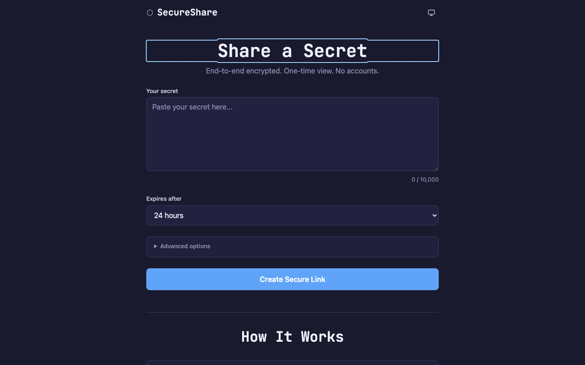
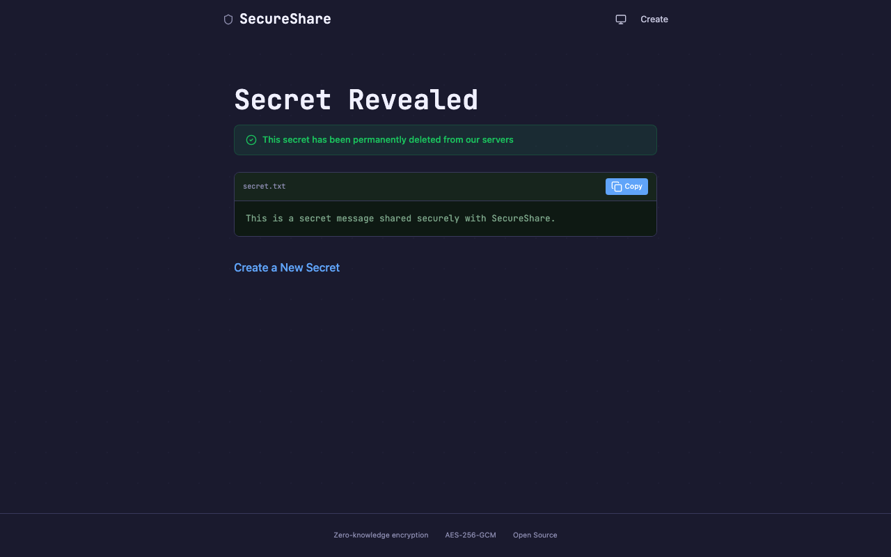
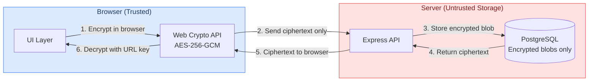

# SecureShare

**Zero-knowledge, one-time secret sharing.**

[](https://github.com/norcalcoop/secureshare/actions/workflows/ci.yml)
[](https://codecov.io/gh/norcalcoop/secureshare)
[](LICENSE)
[](https://nodejs.org/)
[](https://www.typescriptlang.org/)
[](https://github.com/norcalcoop/secureshare/commits/main)

> **Note:** Badges will render once the repository is public. They use Shields.io, which requires public GitHub API access.

---

<table>
<tr>
<td width="50%">

**Create a secret**



</td>
<td width="50%">

**Reveal and destroy**



</td>
</tr>
</table>

---

## What is SecureShare?

SecureShare is a self-hosted web application for sharing sensitive information exactly once. Paste a secret, get an encrypted link, share it with someone, and the secret self-destructs after a single view. No accounts, no signup, no tracking.

What makes SecureShare different is its **zero-knowledge architecture**. Encryption and decryption happen entirely in your browser using the Web Crypto API (AES-256-GCM). The encryption key lives exclusively in the URL fragment (`#key`) -- the part of the URL that browsers never send to servers per the HTTP specification. The server is untrusted storage: it handles encrypted blobs but never touches plaintext or encryption keys.

If the server is compromised, an attacker gets a database full of encrypted noise. Without the keys that exist only in shared URLs, the data is meaningless.

## Features

- **Zero-knowledge encryption** -- AES-256-GCM via the Web Crypto API, no third-party crypto libraries
- **One-time viewing** -- atomic retrieve-and-destroy ensures secrets cannot be replayed
- **Optional password protection** -- Argon2id server-side hashing (OWASP-recommended parameters)
- **Configurable expiration** -- 1 hour, 24 hours, 7 days, or 30 days
- **No accounts required** -- no signup, no login, no tracking
- **PADME padding** -- prevents ciphertext length analysis with at most 12% overhead
- **Rate limiting** -- Redis-backed or in-memory, configurable per endpoint
- **Content Security Policy** -- per-request nonces via Helmet
- **Accessible** -- WCAG 2.1 AA compliant, keyboard navigable, screen reader tested
- **Themeable** -- light, dark, and system-preference modes with localStorage persistence

## How It Works

SecureShare enforces two trust boundaries. The **browser** is the trusted environment where all cryptographic operations happen. The **server** is untrusted storage that handles only encrypted blobs and metadata.



The encryption key is embedded in the URL fragment (`#base64url-key`). Per [RFC 3986](https://www.rfc-editor.org/rfc/rfc3986#section-3.5), browsers never send the fragment to the server. This means the key exists only in the shared URL and in the browser's memory during decryption. The server never has access to it.

When a secret is retrieved, the server performs an **atomic three-step transaction**: SELECT the encrypted row, zero out the ciphertext column, DELETE the row. This ensures a secret can only be read once, even under concurrent requests. If the database is dumped at any point, it contains only encrypted blobs (or zeroed rows) with no way to decrypt them.

## Quick Start

### Prerequisites

- [Node.js](https://nodejs.org/) 24+
- [PostgreSQL](https://www.postgresql.org/) 17+
- [Redis](https://redis.io/) (optional, for distributed rate limiting)

### Option 1: Docker (recommended)

```bash
git clone https://github.com/norcalcoop/secureshare.git
cd secureshare
docker compose up
```

This starts PostgreSQL, Redis, and the application. Visit [http://localhost:3000](http://localhost:3000).

### Option 2: Local development

```bash
git clone https://github.com/norcalcoop/secureshare.git
cd secureshare
npm install

# Configure environment
cp .env.example .env
# Edit .env with your PostgreSQL connection string

# Run database migrations
npm run db:migrate

# Start dev servers (backend + frontend)
npm run dev:server   # Terminal 1: Express on :3000
npm run dev:client   # Terminal 2: Vite on :5173 (proxies API to :3000)
```

Visit [http://localhost:5173](http://localhost:5173) for the Vite dev server with hot reload.

## Tech Stack

| Layer      | Technology                                  |
| ---------- | ------------------------------------------- |
| Runtime    | Node.js 24, TypeScript 5.9                  |
| Backend    | Express 5, Drizzle ORM, PostgreSQL 17, Pino |
| Frontend   | Vanilla TypeScript, Vite 7, Tailwind CSS 4  |
| Encryption | Web Crypto API (AES-256-GCM)                |
| Testing    | Vitest 4, Playwright, vitest-axe            |
| Quality    | ESLint 10, Prettier, Husky pre-commit hooks |
| Deployment | Docker, Render.com Blueprint                |

## Project Structure

```
secureshare/
  client/           Vanilla TypeScript SPA (Vite + Tailwind CSS 4)
  server/           Express 5 API with Drizzle ORM
  shared/           Zod schemas and TypeScript interfaces
  e2e/              Playwright end-to-end tests
  scripts/          Screenshot automation and utility scripts
  drizzle/          Generated database migrations
  docker-compose.yml   One-command local development
  render.yaml          Render.com deployment Blueprint
```

## Development

| Command                | Description                                             |
| ---------------------- | ------------------------------------------------------- |
| `npm run dev:server`   | Start backend dev server (tsx watch)                    |
| `npm run dev:client`   | Start frontend dev server (Vite, proxies /api to :3000) |
| `npm test`             | Run all tests in watch mode                             |
| `npm run test:run`     | Run all tests once                                      |
| `npm run test:e2e`     | Run Playwright E2E tests                                |
| `npm run lint`         | Run ESLint across the codebase                          |
| `npm run format`       | Format all files with Prettier                          |
| `npm run db:generate`  | Generate migration from schema changes                  |
| `npm run db:migrate`   | Apply database migrations                               |
| `npm run build:client` | Production frontend build                               |

## Deployment

SecureShare ships with a [Render.com Blueprint](render.yaml) for one-click production deployment. The `render.yaml` defines the web service, PostgreSQL database, and Redis instance with health check configuration.

For custom deployments, use the included multi-stage [Dockerfile](Dockerfile). The production image runs as a non-root user and contains no dev dependencies.

See [CONTRIBUTING.md](CONTRIBUTING.md) for detailed deployment instructions.

## Contributing

We welcome contributions! Whether it is a bug fix, feature idea, or documentation improvement, we would love to hear from you.

See our [Contributing Guide](CONTRIBUTING.md) for setup instructions, code style conventions, and the pull request process. The project uses ESLint 10, Prettier, and Husky pre-commit hooks to enforce quality automatically.

## License

ISC -- see [LICENSE](LICENSE) for details.
